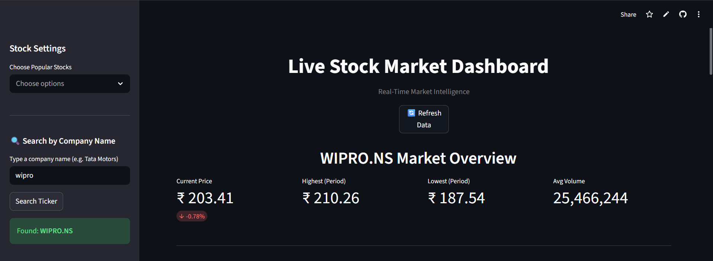
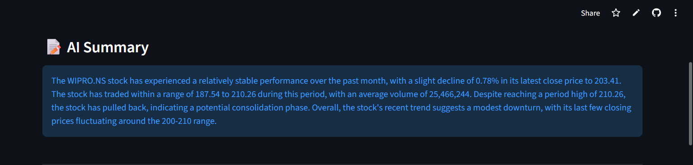
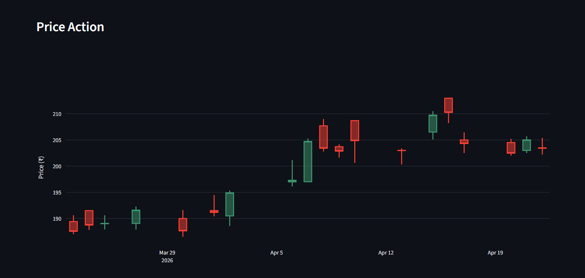
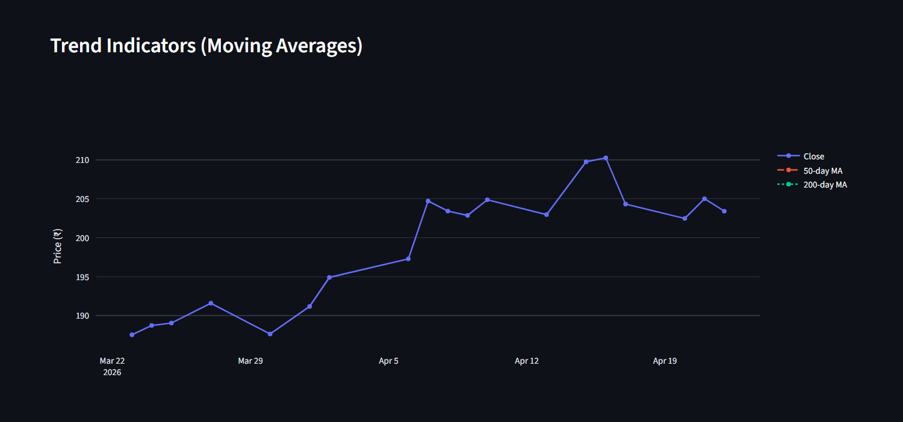
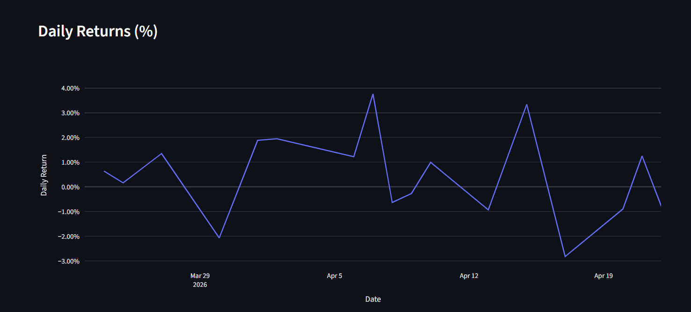

# 📈 Live Stock Market Dashboard

An AI-powered real-time stock market dashboard built with **Streamlit**, **yFinance**, and **Groq LLM**.

Search any company by name — the AI finds the ticker automatically. Get live charts, technical indicators, and an AI-generated market summary.

## 🚀 Live Demo

[](https://stockmarketapi-ayushdwd.streamlit.app/)

👉 **[https://stockmarketapi-ayushdwd.streamlit.app/](https://stockmarketapi-ayushdwd.streamlit.app/)**

---

## 📸 Screenshots

### 🏠 Dashboard Overview


### 🤖 AI Summary


### 🕯️ Price Action (Candlestick Chart)


### 📊 Trend Indicators (Moving Averages)


### 📉 Daily Returns


---

## ✨ Features

- 🤖 **AI Ticker Search** — Type any company name (e.g. "Tata Motors", "Netflix") and Groq LLM finds the correct ticker symbol automatically
- 📝 **AI Stock Summary** — LLM generates a 3-4 sentence analysis of the stock's recent performance and trend
- 🕯️ **Candlestick Charts** — Interactive price action visualization
- 📊 **Moving Averages** — 50-day and 200-day trend indicators
- 📉 **Daily Returns** — Percentage return chart over time
- 📦 **Volume Analysis** — Trading volume bar chart
- 🌍 **Multi-Stock Comparison** — Normalized performance and absolute price comparison
- 💱 **INR Conversion** — Foreign stocks automatically converted to Indian Rupees
- 🔄 **Auto Retry** — Handles Yahoo Finance rate limiting with smart retry logic

---

## 🛠️ Tech Stack

| Tool | Purpose |
|---|---|
| Streamlit | Web app framework |
| yFinance | Stock data fetching |
| Groq (Llama 3.3 70B) | AI ticker search + summary |
| Plotly | Interactive charts |
| Pandas | Data processing |
| python-dotenv | Local environment variables |

---

## 🚀 Run Locally

**1. Clone the repo**
```bash
git clone https://github.com/ayushdwd00/stockmarketapi.git
cd stockmarketapi
```

**2. Install dependencies**
```bash
pip install -r requirements.txt
```

**3. Add your Groq API key**

Create a `.env` file in the project root:
```
GROQ_API_KEY=gsk_xxxxxxxxxxxxxxxx
```
Get your free API key at [console.groq.com](https://console.groq.com)

**4. Run the app**
```bash
streamlit run app.py
```

---

## ☁️ Deploy on Streamlit Cloud

1. Push your code to GitHub (`.env` is gitignored — never committed)
2. Go to [share.streamlit.io](https://share.streamlit.io) and connect your repo
3. Go to **App Settings → Secrets** and add:
```toml
GROQ_API_KEY = "gsk_xxxxxxxxxxxxxxxx"
```
4. Deploy 🚀

---

## 🔍 Example Searches

| Type | Company Name | Ticker |
|---|---|---|
| 🇮🇳 Indian | Tata Motors | TATAMOTORS.NS |
| 🇮🇳 Indian | State Bank of India | SBIN.NS |
| 🇮🇳 Indian | Zomato | ZOMATO.NS |
| 🇮🇳 Indian | Bajaj Finance | BAJFINANCE.NS |
| 🇮🇳 Indian | Wipro | WIPRO.NS |
| 🇺🇸 US | Google | GOOGL |
| 🇺🇸 US | Netflix | NFLX |
| 🇺🇸 US | Palantir | PLTR |

---

## 📁 Project Structure

```
stockmarketapi/
├── app.py              # Main Streamlit app
├── requirements.txt    # Python dependencies
├── .env                # Local API keys (gitignored)
├── .gitignore          # Ignores .env and secrets
├── images/             # Screenshots for README
└── README.md           # This file
```

---

## ⚠️ Known Limitations

- Yahoo Finance may rate-limit requests on shared IPs — click **🔄 Refresh Data** to retry
- AI ticker search requires a valid Groq API key
- 50-day and 200-day MAs require sufficient historical data (use 3mo+ period)

---

## 👨‍💻 Author

**Ayush Dwivedi**

---

## ⭐ Show Your Support

If you found this useful, give it a ⭐ on GitHub!
