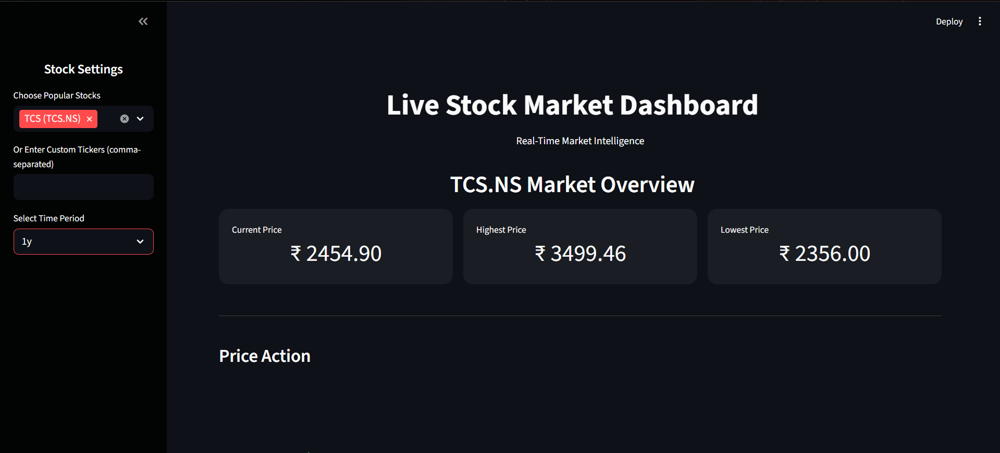
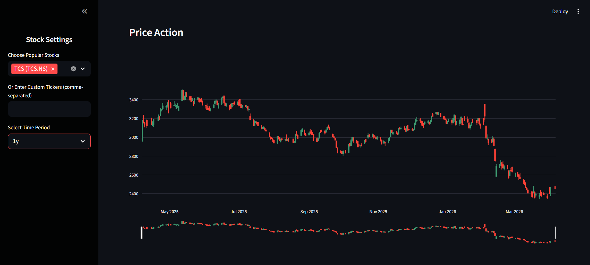
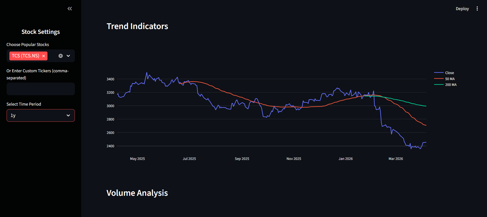
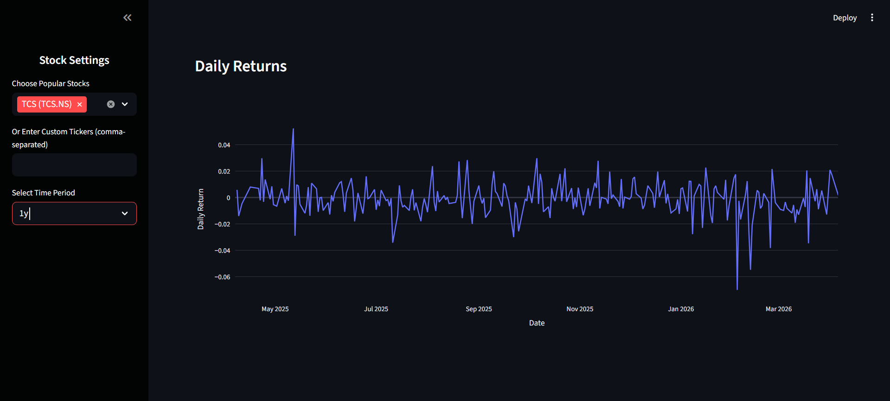

# 📊 Live Stock Market Dashboard

A real-time stock market dashboard built using **Streamlit** that provides interactive charts, technical indicators, and market insights.

---

## 🚀 Features

* 📈 Real-time stock data using Yahoo Finance
* 🕯️ Candlestick charts for price analysis
* 📊 Moving averages (50 & 200)
* 📉 Daily returns visualization
* 📦 Volume analysis
* 🔍 Support for custom stock tickers

---

## 🛠 Tech Stack

* Python
* Streamlit
* Pandas
* Plotly
* yFinance

---

## 📸 Preview

### 🏠 Dashboard Overview



### 📈 Price Action (Candlestick Chart)



### 📊 Trend Indicators



### 📉 Daily Returns



---

## ▶️ Run Locally

```bash
pip install -r requirements.txt
streamlit run app.py
```

---

## 👨‍💻 Author

**Ayush Dwivedi**

---

## ⭐ Show Your Support

If you like this project, give it a ⭐ on GitHub!
